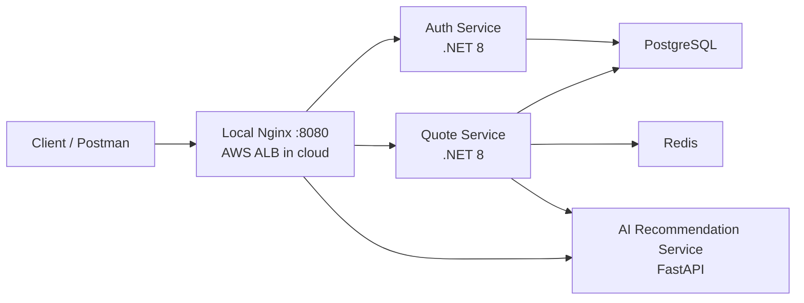

# FreightRate AI

[](https://github.com/HimanshuBansal81/freightrate-ai/actions/workflows/ci.yml)

Cloud-native freight quote backend that calculates multi-carrier pricing deterministically and uses AI only to explain the selected recommendation.

## Demo & Review Guide

The repository includes architecture notes, API examples, screenshots, sanitized sample outputs, and a Postman collection for quick review.

Recommended links:

- [Demo guide](docs/demo-guide.md)
- [Copy-paste API requests](docs/demo-requests.md)
- [Demo screenshots](docs/demo-screenshots/README.md)
- [Architecture notes](docs/architecture.md)
- [AWS deployment plan](docs/aws-deployment.md)
- [GitHub Actions CI](https://github.com/HimanshuBansal81/freightrate-ai/actions/workflows/ci.yml)

Technical reviewers can also run the full backend stack locally with Docker Compose. No real AI provider key is
required for the default demo because `AI_PROVIDER=none` uses the deterministic fallback explanation path.

## Visual Proof

Screenshots in [docs/demo-screenshots](docs/demo-screenshots/) show CI, Docker Compose, health checks, the API flow, quote comparison, quote history, and AI explanation behavior.


## Architecture Overview

FreightRate AI is a small service-oriented monorepo:

- Auth Service: .NET 8 API for registration, login, JWT issuance, users, and roles.
- Quote Service: .NET 8 API for quote calculation, carrier comparison, quote history, Redis caching, and AI explanation integration.
- AI Recommendation Service: Python FastAPI service for concise recommendation explanations.
- PostgreSQL: source of truth for users, roles, carriers, zones, rate rules, quote requests, and quote options.
- Redis: read-through cache for carrier, zone, and rate-rule reference data.
- Nginx: local Docker Compose reverse proxy at `localhost:8080`.
- AWS ECS Fargate: primary cloud deployment target, with Application Load Balancer path routing.



Local Docker Compose uses Nginx for path-based routing. In AWS, that role is handled by an Application Load
Balancer with equivalent `/auth/*`, `/quotes/*`, and `/ai/*` listener rules.

## Tech Stack

- .NET 8, ASP.NET Core, Entity Framework Core
- Python, FastAPI, Pydantic
- PostgreSQL, Redis
- Docker, Docker Compose, Nginx
- xUnit, GitHub Actions
- AWS ECS Fargate, ECR, ALB, RDS, ElastiCache, Secrets Manager, CloudWatch

## Key Features

- JWT authentication with Admin and Shipper roles
- User-scoped quote history
- Multi-carrier quote comparison
- Volumetric and chargeable weight calculation
- Zone-based pricing, fuel surcharge, and GST
- Cheapest, Fastest, and Balanced recommendation modes
- Redis caching with PostgreSQL fallback
- Recommendation explanations with deterministic fallback
- Standard API error response contract
- Unit tests for quote logic, recommendation selection, Redis fallback, and AI fallback
- GitHub Actions CI for .NET build/test, Docker Compose validation, and Python import checks

## What AI Does

The Quote Service calculates prices and selects the recommended carrier. The AI Recommendation Service receives that structured decision context and returns a concise explanation.

AI does not calculate prices, modify quote amounts, invent carriers, override recommendations, or act as the source of truth for business decisions.

## Local Setup

Prerequisites:

- Docker Desktop
- .NET 8 SDK
- `curl` or Postman

Quickstart:

```bash
cp .env.example .env
docker compose up --build -d
curl http://localhost:8080/auth/health
curl http://localhost:8080/quotes/health
curl http://localhost:8080/ai/health
```

Set `JWT_SECRET` in `.env` to a local development value of at least 32 characters. Keep `AI_PROVIDER=none` unless testing a real AI provider locally.

Local Docker Compose routes:

- Auth: `http://localhost:8080/auth`
- Quote: `http://localhost:8080/quotes`
- AI: `http://localhost:8080/ai`

Direct debug ports:

- Auth Service: `http://localhost:5001`
- Quote Service: `http://localhost:5002`
- AI Recommendation Service: `http://localhost:8000`

## Health Checks

```bash
curl http://localhost:8080/auth/health
curl http://localhost:8080/quotes/health
curl http://localhost:8080/ai/health
```

## API Examples

Register a shipper:

```bash
curl -sS -X POST http://localhost:8080/auth/api/auth/register \
  -H "Content-Type: application/json" \
  -d '{
    "fullName": "Demo Shipper",
    "email": "demo.shipper@example.com",
    "password": "Passw0rd!",
    "role": "Shipper"
  }'
```

Login and capture a token:

```bash
TOKEN=$(curl -sS -X POST http://localhost:8080/auth/api/auth/login \
  -H "Content-Type: application/json" \
  -d '{
    "email": "demo.shipper@example.com",
    "password": "Passw0rd!"
  }' | python3 -c 'import json,sys; print(json.load(sys.stdin)["token"])')
```

Compare quotes:

```bash
curl -sS -X POST http://localhost:8080/quotes/api/quotes/compare \
  -H "Content-Type: application/json" \
  -H "Authorization: Bearer $TOKEN" \
  -d '{
    "originPincode": "110001",
    "destinationPincode": "560001",
    "actualWeightKg": 8,
    "lengthCm": 40,
    "widthCm": 30,
    "heightCm": 25,
    "preference": "Balanced"
  }'
```

For this seeded sample, the deterministic values are:

- `volumetricWeightKg`: `6`
- `chargeableWeightKg`: `8`
- Xpressbees total: `166.14`
- Delhivery total: `192.95`
- BlueDart total: `284.97`
- Balanced recommendation: `Xpressbees`

Other useful endpoints:

- `GET /quotes/api/carriers`
- `GET /quotes/api/zones`
- `GET /quotes/api/quotes/history`
- `GET /quotes/api/quotes/{id}`
- `GET /quotes/api/admin/rate-rules`
- `POST /ai/api/recommendations/explain`

## Sample Quote Response

```json
{
  "recommendedCarrier": "Xpressbees",
  "recommendedAmount": 166.14,
  "aiExplanation": "Xpressbees is recommended because it best matches your Balanced preference based on the calculated price and delivery time.",
  "options": [
    {
      "carrier": "Xpressbees",
      "totalAmount": 166.14,
      "estimatedDeliveryDays": 5
    },
    {
      "carrier": "Delhivery",
      "totalAmount": 192.95,
      "estimatedDeliveryDays": 4
    },
    {
      "carrier": "BlueDart",
      "totalAmount": 284.97,
      "estimatedDeliveryDays": 2
    }
  ]
}
```

## Testing

Run the .NET solution build and test suite:

```bash
dotnet build FreightRateAI.sln
dotnet test FreightRateAI.sln
```

Run the Python import check:

```bash
cd services/ai-recommendation-service
python -c "from app.main import app; print(app.title)"
```

## CI

GitHub Actions runs:

- .NET restore, build, and test
- Docker Compose config validation and image build
- Python dependency install and FastAPI app import check

Workflow: [`.github/workflows/ci.yml`](.github/workflows/ci.yml)

## AWS Deployment Status

The backend MVP and AWS deployment plan are documented. This repository does not claim a live AWS deployment unless the services have been deployed separately.

AWS ECS Fargate is the primary deployment path. The plan uses:

- ECR for service images
- ECS Fargate for Auth, Quote, and AI containers
- Application Load Balancer for `/auth/*`, `/quotes/*`, and `/ai/*` routing
- RDS PostgreSQL for managed relational storage
- ElastiCache Redis for managed caching
- AWS Secrets Manager for JWT secrets, database connection strings, Redis connection strings, and optional AI provider keys
- CloudWatch Logs for centralized logging
- IAM roles scoped to each service

Deployment docs:

- [AWS deployment plan](docs/aws-deployment.md)
- [AWS environment matrix](docs/aws-env-matrix.md)
- [ECS task definition notes](docs/ecs-task-definition-notes.md)
- Optional alternative: [Cloud Run deployment guide](docs/cloud-run-deployment.md)
- Optional alternative: [Cloud environment matrix](docs/cloud-env-matrix.md)

## Security and Configuration

`.env.example` is a local development template. `.env` is ignored and must not be committed.

Real secrets and API keys should be stored only in a local `.env` file or in cloud secret managers. AWS deployment
should use ECS task environment variables for non-secret settings and AWS Secrets Manager for sensitive values.

If a real secret is ever pushed to Git, rotate or revoke it with the provider. Removing it from the latest commit is not enough because Git history may retain it.

## Repository Layout

```text
repo-root/
├── README.md
├── docker-compose.yml
├── docs/
├── reverse-proxy/
├── scripts/
├── services/
│   ├── auth-service/
│   ├── quote-service/
│   ├── quote-service.tests/
│   └── ai-recommendation-service/
└── shared/
    └── contracts/
```
