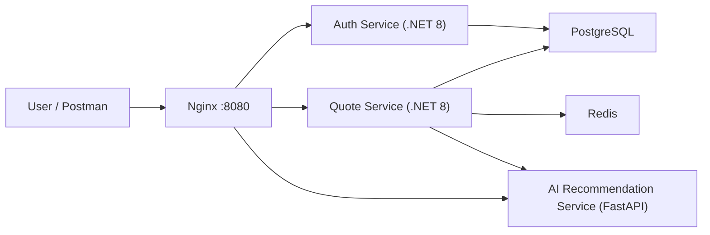

# FreightRate AI — Cloud-Native Multi-Carrier Freight Quote System

Cloud-native logistics pricing system that compares freight quotes across multiple carriers using volumetric weight, zone-based pricing, surcharge, GST, ETA, Redis caching, JWT auth, and AI-assisted recommendation explanations.

## Architecture Overview

FreightRate AI is a backend MVP built as a small service-oriented monorepo:

- Auth Service: .NET 8 Web API for registration, login, JWTs, users, and roles.
- Quote Service: .NET 8 Web API for deterministic freight pricing, quote history, Redis caching, JWT authorization, and AI explanation integration.
- AI Recommendation Service: Python FastAPI service that explains backend-selected recommendations.
- PostgreSQL: relational source of truth for users, quote data, carriers, zones, and rate rules.
- Redis: read-through cache for active carriers, pincode-zone mapping, and lane rate rules.
- Nginx: local path-based reverse proxy.
- Docker Compose: local runtime.
- Google Cloud Run: planned container deployment target.



## Key Features

- JWT authentication
- Admin and Shipper roles
- Multi-carrier quote comparison
- Volumetric weight calculation
- Chargeable weight selection
- Zone-based pricing
- Fuel surcharge calculation
- GST calculation
- Cheapest, Fastest, and Balanced recommendation modes
- User-scoped quote history
- Redis caching with PostgreSQL fallback
- AI explanation with deterministic fallback
- Standard API error response contract
- Dockerized local development
- Unit tests for core quote logic

## What AI Does

AI only explains the backend-selected recommendation. It receives structured quote results and returns a short explanation.

AI does not:

- Calculate prices
- Modify quote amounts
- Invent carriers
- Override the backend recommendation
- Become the source of truth for pricing

## Local Setup

Prerequisites:

- Docker Desktop
- .NET 8 SDK
- `curl` or Postman

### Local environment setup

Create a local environment file from the tracked example:

```bash
cp .env.example .env
```

Edit `.env` locally if needed. Never commit `.env` or provider credentials.

Start the stack from the repository root:

```bash
docker compose up --build -d
```

Health checks:

```bash
curl http://localhost:8080/auth/health
curl http://localhost:8080/quotes/health
curl http://localhost:8080/ai/health
```

For AI provider integration, the local demo works with `AI_PROVIDER=none`. Real provider keys must be added only to your local `.env` file or a cloud secret manager, never to source control.

Direct service ports are also published:

- Auth Service: `http://localhost:5001`
- Quote Service: `http://localhost:5002`
- AI Recommendation Service: `http://localhost:8000`
- Nginx gateway: `http://localhost:8080`

## Auth Flow

Register a Shipper:

```bash
curl -sS -X POST http://localhost:8080/auth/api/auth/register \
  -H "Content-Type: application/json" \
  -d '{
    "fullName": "Demo Shipper",
    "email": "demo.shipper@example.com",
    "password": "Passw0rd!",
    "role": "Shipper"
  }'
```

Login:

```bash
TOKEN=$(curl -sS -X POST http://localhost:8080/auth/api/auth/login \
  -H "Content-Type: application/json" \
  -d '{
    "email": "demo.shipper@example.com",
    "password": "Passw0rd!"
  }' | python3 -c 'import json,sys; print(json.load(sys.stdin)["token"])')
```

## Quote Compare

```bash
curl -sS -X POST http://localhost:8080/quotes/api/quotes/compare \
  -H "Content-Type: application/json" \
  -H "Authorization: Bearer $TOKEN" \
  -d '{
    "originPincode": "110001",
    "destinationPincode": "560001",
    "actualWeightKg": 8,
    "lengthCm": 40,
    "widthCm": 30,
    "heightCm": 25,
    "preference": "Balanced"
  }'
```

Important expected values for this sample:

- `volumetricWeightKg`: `6`
- `chargeableWeightKg`: `8`
- Xpressbees total: `166.14`
- Delhivery total: `192.95`
- BlueDart total: `284.97`
- Balanced recommendation: `Xpressbees`

## Other Useful Endpoints

Public:

- `GET /quotes/api/carriers`
- `GET /quotes/api/zones`
- `POST /ai/api/recommendations/explain`

Protected:

- `POST /quotes/api/quotes/compare`
- `GET /quotes/api/quotes/history`
- `GET /quotes/api/quotes/{id}`

Admin only:

- `GET /quotes/api/admin/rate-rules`

## Testing

Run Quote Service tests:

```bash
dotnet test services/quote-service.tests/quote-service.tests.csproj -v minimal
```

The tests cover freight math, recommendation selection, AI fallback, and Redis/DB fallback behavior.

## Folder Structure

```text
repo-root/
├── README.md
├── docker-compose.yml
├── docs/
├── reverse-proxy/
├── services/
│   ├── auth-service/
│   ├── quote-service/
│   ├── quote-service.tests/
│   └── ai-recommendation-service/
└── shared/
    └── contracts/
```

## Production Notes

If any real secret was pushed to GitHub, rotate or revoke it immediately from the provider dashboard. Removing it from the latest commit is not enough because it may remain in Git history.

Low-cost deployment path:

- Cloud Run for Auth, Quote, and AI service containers
- Artifact Registry for container images
- Secret Manager for JWT secrets, database URLs, Redis URLs, and optional AI provider keys
- Cloud Logging for centralized logs
- Neon or Supabase for PostgreSQL
- Upstash Redis for cache

Full GCP deployment path:

- Cloud Run
- Artifact Registry
- Secret Manager
- Cloud SQL for PostgreSQL
- Memorystore for Redis
- API Gateway or HTTPS Load Balancer for routing
- Cloud Logging and Cloud Monitoring

## Interview Explanation

FreightRate AI demonstrates a practical backend system for logistics quote comparison. Pricing is deterministic and auditable: the Quote Service owns volumetric weight, chargeable weight, carrier rules, surcharges, GST, ETA comparison, and recommendation selection. AI is intentionally isolated as an explanation layer so it cannot change money values or business decisions.

Redis is used as a performance optimization for read-heavy carrier, zone, and rate-rule lookups. PostgreSQL remains the source of truth, and Quote Service falls back to the database if Redis is unavailable. JWTs are issued by Auth Service and validated locally by Quote Service, which avoids a network call on every quote request. For production, the shared-secret JWT setup can evolve to asymmetric signing keys.

Cloud Run is a strong fit because each service is independently containerized, stateless at the API layer, and can scale to zero for low-cost environments.
