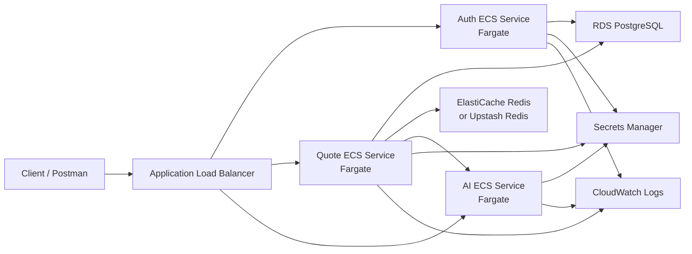

# AWS ECS Fargate Deployment Plan

FreightRate AI is prepared for an AWS-first container deployment, but this repository does not deploy infrastructure automatically. Do not commit production `.env` files, database URLs, Redis URLs, JWT secrets, or AI provider keys.

## Architecture Overview

AWS replaces the local Docker Compose runtime services with managed container, networking, data, secret, and logging services:



Local Docker Compose still uses Nginx for path-based routing. AWS should use an Application Load Balancer for managed path-based routing.

## Deployment Components

- ECS Fargate: runs Auth Service, Quote Service, and AI Recommendation Service as separate tasks and services.
- ECR: stores Docker images for `auth-service`, `quote-service`, and `ai-recommendation-service`.
- Application Load Balancer: exposes one public endpoint and routes requests by path.
- RDS PostgreSQL: managed relational database for users, quote data, carriers, zones, and rate rules.
- ElastiCache Redis: managed Redis cache for Quote Service. Upstash Redis is a low-cost alternative for demos.
- AWS Secrets Manager: stores JWT secrets, database connection strings, Redis connection strings, and optional AI provider keys.
- CloudWatch Logs: receives stdout/stderr logs from ECS tasks.
- IAM: grants ECS task execution permissions, ECR image pull permissions, CloudWatch log writes, and task access to required secrets.

## Deployment Order

1. Create ECR repositories.
2. Build and push Docker images.
3. Provision RDS PostgreSQL.
4. Provision Redis using ElastiCache or use Upstash as a low-cost alternative.
5. Store secrets in Secrets Manager.
6. Create ECS cluster.
7. Create task definitions for Auth, Quote, and AI.
8. Create ECS services.
9. Configure ALB listener rules:
   - `/auth/*` -> Auth target group
   - `/quotes/*` -> Quote target group
   - `/ai/*` -> AI target group
10. Test health endpoints.
11. Test Auth login and Quote compare flow.

## 1. Create ECR Repositories

Choose a namespace or repository prefix such as `freightrate-ai`. Example repository names:

```text
freightrate-ai/auth-service
freightrate-ai/quote-service
freightrate-ai/ai-recommendation-service
```

Example AWS CLI pattern:

```bash
export AWS_REGION="ap-south-1"
export ECR_REPOSITORY_PREFIX="freightrate-ai"

aws ecr create-repository --region "$AWS_REGION" --repository-name "$ECR_REPOSITORY_PREFIX/auth-service"
aws ecr create-repository --region "$AWS_REGION" --repository-name "$ECR_REPOSITORY_PREFIX/quote-service"
aws ecr create-repository --region "$AWS_REGION" --repository-name "$ECR_REPOSITORY_PREFIX/ai-recommendation-service"
```

Use the region closest to the application users and managed database.

## 2. Build And Push Docker Images

Run from the repository root after configuring AWS CLI credentials locally:

```bash
export AWS_REGION="ap-south-1"
export AWS_ACCOUNT_ID="<aws-account-id>"
export ECR_REPOSITORY_PREFIX="freightrate-ai"

./scripts/aws-build-push-images.sh
```

The script builds from the repository root using these Dockerfile paths:

- `services/auth-service/Dockerfile`
- `services/quote-service/Dockerfile`
- `services/ai-recommendation-service/Dockerfile`

## 3. Provision RDS PostgreSQL

Create an RDS PostgreSQL instance or cluster with private networking where possible. The Auth and Quote services can share one database server while using separate databases, matching the local Docker Compose setup:

- `freightrate_auth`
- `freightrate_quote`

Store connection strings in Secrets Manager. Use SSL for managed database connections.

Example placeholder connection string:

```text
Host=<rds-endpoint>;Port=5432;Database=<database>;Username=<user>;Password=<password>;SSL Mode=Require;Trust Server Certificate=true
```

## 4. Provision Redis

Preferred AWS option:

- ElastiCache Redis in private subnets accessible by the Quote ECS service.

Low-cost demo alternative:

- Upstash Redis with TLS enabled.

Store the Redis connection string in Secrets Manager.

Example placeholder:

```text
<redis-host>:<port>,password=<password>,ssl=True,abortConnect=False
```

## 5. Store Secrets In Secrets Manager

Recommended secret names:

- `freightrate-ai/jwt-secret`
- `freightrate-ai/auth-db-connection`
- `freightrate-ai/quote-db-connection`
- `freightrate-ai/redis-connection-string`
- `freightrate-ai/openai-api-key` optional
- `freightrate-ai/anthropic-api-key` optional
- `freightrate-ai/azure-openai-api-key` optional

Keep non-secret settings such as issuer, audience, timeouts, and environment names as task definition environment variables.

## 6. Create ECS Cluster

Create an ECS cluster for the application. Fargate launch type is enough for the MVP because each service is containerized and stateless at the API layer.

## 7. Create Task Definitions

Create one task definition per service:

- Auth task: .NET container, port `8080`
- Quote task: .NET container, port `8080`
- AI task: FastAPI container, set `PORT=8080` for AWS consistency or expose/use the documented configured port

Inject secrets from AWS Secrets Manager and configure `awslogs` for CloudWatch Logs.

## 8. Create ECS Services

Create one ECS service per task definition. Attach each service to the matching ALB target group. Prefer private subnets for tasks and route public traffic through the ALB.

## 9. Configure ALB Listener Rules

Create target groups for each service and configure listener rules:

| Path pattern | Target group |
| --- | --- |
| `/auth/*` | Auth target group |
| `/quotes/*` | Quote target group |
| `/ai/*` | AI target group |

Each target group should use `/health` for health checks. The local Nginx path prefixes are preserved at the ALB layer.

## 10. Test Health Endpoints

After the ALB DNS name is available:

```bash
export ALB_URL="https://<alb-dns-or-custom-domain>"

curl "$ALB_URL/auth/health"
curl "$ALB_URL/quotes/health"
curl "$ALB_URL/ai/health"
```

## 11. Test Auth And Quote Flow

Register or log in through the Auth route, capture the JWT, then call Quote Service through the ALB:

```bash
curl -sS -X POST "$ALB_URL/auth/api/auth/register" \
  -H "Content-Type: application/json" \
  -d '{
    "fullName": "Demo Shipper",
    "email": "demo.shipper@example.com",
    "password": "Passw0rd!",
    "role": "Shipper"
  }'
```

```bash
TOKEN=$(curl -sS -X POST "$ALB_URL/auth/api/auth/login" \
  -H "Content-Type: application/json" \
  -d '{
    "email": "demo.shipper@example.com",
    "password": "Passw0rd!"
  }' | python3 -c 'import json,sys; print(json.load(sys.stdin)["token"])')
```

```bash
curl -sS -X POST "$ALB_URL/quotes/api/quotes/compare" \
  -H "Content-Type: application/json" \
  -H "Authorization: Bearer $TOKEN" \
  -d '{
    "originPincode": "110001",
    "destinationPincode": "560001",
    "actualWeightKg": 8,
    "lengthCm": 40,
    "widthCm": 30,
    "heightCm": 25,
    "preference": "Balanced"
  }'
```

## IAM Notes

Use separate IAM roles for task execution and application runtime permissions:

- Task execution role: pull from ECR and write logs to CloudWatch.
- Task role: read only the specific Secrets Manager secrets needed by that service.

Avoid broad `secretsmanager:*` policies. Scope permissions to explicit secret ARNs.

## GCP Alternative

The existing Cloud Run documentation remains useful for a simpler container deployment path:

- [Cloud Run deployment guide](cloud-run-deployment.md)
- [GCP deployment notes](gcp-deployment.md)
