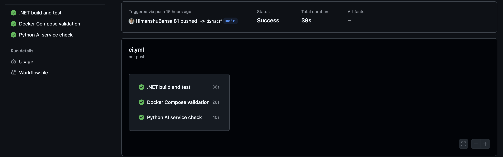
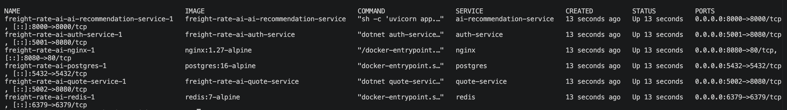
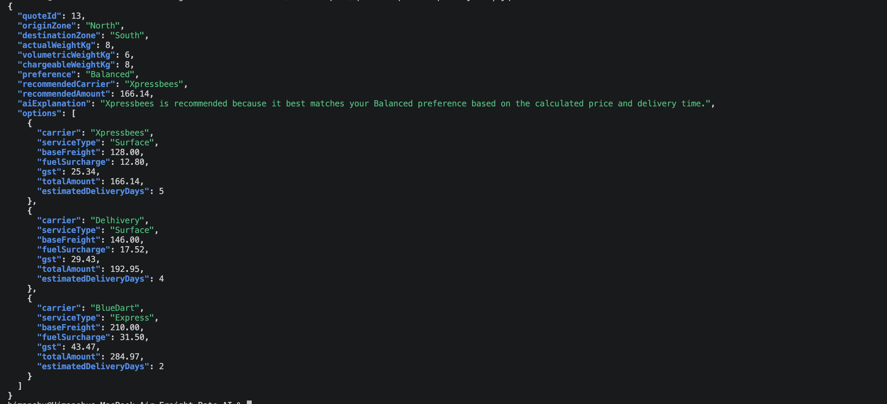
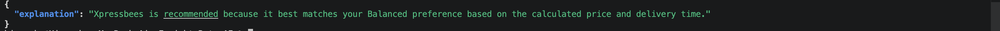

# Demo Guide

FreightRate AI is a backend MVP for comparing freight shipment quotes across multiple logistics carriers. It demonstrates deterministic pricing, service boundaries, authentication, persistence, caching, CI, and cloud deployment readiness.

This guide is written for recruiters, interviewers, and technical reviewers who want to understand the project quickly. The project can be reviewed through docs and API examples without running Docker locally. Reviewers who want to test the full flow can use Docker Compose.

## Project Purpose

FreightRate AI helps a shipper compare carrier options for a delivery lane. Given origin and destination pincodes, package dimensions, actual weight, and a preference such as `Balanced`, the backend calculates quote options from seeded carrier rate rules and recommends the best carrier.

The AI service does not calculate prices. It only explains the recommendation already selected by the Quote Service.

## Problem It Solves

Freight pricing is often hard to compare because each carrier can have different rate cards, delivery speeds, surcharges, and serviceability rules. This project centralizes the comparison workflow:

- Validate the requested lane and package input.
- Calculate volumetric and chargeable weight.
- Apply carrier-specific rate rules, fuel surcharge, and GST.
- Recommend a carrier using deterministic business rules.
- Store quote history per authenticated user.
- Provide an explanation of the recommendation without making AI the source of truth.

## Architecture Summary

The project is a service-oriented monorepo using Docker Compose for local orchestration and AWS ECS Fargate as the primary cloud deployment target.

- Nginx routes local requests from `localhost:8080` to each backend service.
- Auth Service and Quote Service are .NET 8 APIs.
- AI Recommendation Service is a Python FastAPI service.
- PostgreSQL stores users, roles, carriers, zones, rate rules, quote requests, and quote options.
- Redis caches reference data and the Quote Service falls back to PostgreSQL if Redis is unavailable.

See [architecture.md](architecture.md) for the architecture diagram and deeper service notes.

## Services

Auth Service:

- Registers users with `Admin` or `Shipper` roles.
- Logs users in and issues JWTs.
- Provides the authenticated user profile endpoint.

Quote Service:

- Calculates freight quotes.
- Selects the recommended carrier for `Cheapest`, `Fastest`, or `Balanced` preferences.
- Stores quote requests and quote options.
- Protects quote compare and quote history endpoints with JWT auth.
- Reads carrier and zone data from PostgreSQL, using Redis where available.
- Calls the AI Recommendation Service for an explanation.

AI Recommendation Service:

- Accepts the selected recommendation and calculated quote options.
- Returns a concise explanation.
- Uses fallback explanation mode when `AI_PROVIDER=none`, so no real provider key is required.

PostgreSQL:

- Stores source-of-truth application and quote data.
- Is seeded with demo carriers, zones, and North-to-South rate rules.

Redis:

- Caches active carriers, zone mappings, and rate-rule reference data.
- Is optional for correctness because the Quote Service can continue from PostgreSQL.

## Demo Flow

1. Start services.

   ```bash
   cp .env.example .env
   docker compose up --build -d
   ```

2. Register a user.

   Use `POST /auth/api/auth/register` with the sample Shipper payload in [demo-requests.md](demo-requests.md).

3. Login.

   Use `POST /auth/api/auth/login`.

4. Copy the JWT.

   Put the returned token in an `Authorization: Bearer <token>` header for protected quote endpoints.

5. Compare a freight quote.

   Use `POST /quotes/api/quotes/compare` with origin pincode `110001`, destination pincode `560001`, actual weight `8`, dimensions `40 x 30 x 25`, and preference `Balanced`.

6. View quote history.

   Use `GET /quotes/api/quotes/history` with the same bearer token.

7. Test the AI explanation endpoint.

   Use `POST /ai/api/recommendations/explain` to confirm the explanation service works independently.

## Generating Demo Proof Locally

The demo proof scripts require the local Docker Compose containers to be running. They do not start Docker automatically.

Start services:

```bash
docker compose up --build -d
```

Generate sanitized API outputs:

```bash
./scripts/generate-demo-outputs.sh
```

Generated files are written to [demo-outputs](demo-outputs/). Review them before committing. JWT tokens are redacted as `<REDACTED>`, and Authorization headers are not saved.

Verify the same API flow without writing files:

```bash
./scripts/verify-demo-flow.sh
```

Screenshots should be taken manually from terminal, Postman, or GitHub Actions. Do not expose JWT tokens, secrets, or API keys in screenshots.

## Visual Demo Proof

The repository includes screenshots under [demo-screenshots](demo-screenshots/) showing:

- CI passing
- Docker services running
- health endpoints
- end-to-end API flow
- quote comparison response
- quote history
- AI explanation endpoint









See the full screenshot index in [demo-screenshots/README.md](demo-screenshots/README.md).

## What Reviewers Should Notice

- Pricing is deterministic and calculated in the Quote Service from seeded rate rules.
- JWT protection is required for quote comparison and quote history.
- Redis improves reference-data reads, but PostgreSQL fallback preserves correctness.
- AI does not calculate prices, change totals, invent carriers, or override recommendations.
- Standard error responses make API failures predictable.
- CI runs .NET build/test, Docker Compose validation, and Python AI import checks.
- AWS deployment docs cover ECS Fargate, ALB routing, RDS PostgreSQL, ElastiCache Redis, Secrets Manager, CloudWatch, and IAM.
